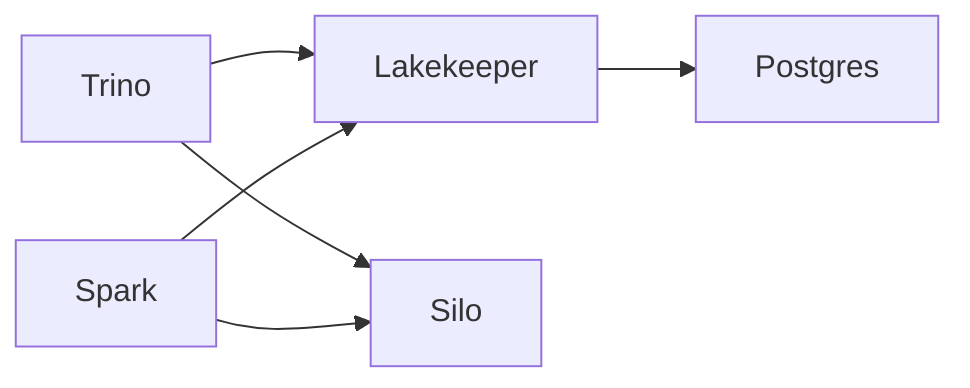

# Практическая работа №1

Lakehouse на Silo (MinIO) + Lakekeeper + Trino, медальон Bronze → Silver → Gold под запрос TPC-H Q3.

## Как запустить

```bash
./infra/up.sh                        # поднять стек
./run_pipeline.sh                    # bronze -> silver -> gold + проверка
./sql/perf/run.sh                    # тест кодеков
./sql/evolution/schema_evolution.sh  # schema evolution
./sql/evolution/time_travel.sh       # восстановление из снапшота
./spark/run.sh                       # spark читает bronze
./infra/down.sh                      # остановить
```

Что где лежит:
- `infra/` — скрипты запуска и конфиги каталогов Trino
- `sql/` — SQL по слоям, тесты и демо снапшотов
- `spark/` — запуск Spark
- `results/` — выводы всех прогонов

## 1. Вариант и масштаб

| Поле | Значение |
|---|---|
| ФИО (как в VK Education) | Гукасян Валерий Александрович |
| Вариант (запрос) | Q3 |
| Масштаб `sfN` | sf1 |
| Почему выбрал такой масштаб | У меня MacBook Air с 8 ГБ оперативки, Docker получает из них около 4 ГБ. На больших объёмах ноутбук начинал греться и тормозить. На sf1 всё считается быстро, а данных достаточно (6 млн строк в lineitem), плюс результат можно сверить с официальным ответом Q3 для SF1. |

## 2. Поднятые сервисы



`docker ps`:

```
NAMES           IMAGE                                    PORTS
p1-trino        trinodb/trino:476                        0.0.0.0:8080->8080/tcp
p1-lakekeeper   quay.io/lakekeeper/catalog:latest-main   0.0.0.0:8181->8181/tcp
p1-pg           postgres:17                              0.0.0.0:5432->5432/tcp
p1-minio        pgsty/silo:latest                        0.0.0.0:9000-9001->9000-9001/tcp
```

| Сервис | Роль в стеке | Почему именно он |
|---|---|---|
| MinIO (Silo) | объектное хранилище, тут лежат parquet-файлы | S3-совместимый, с ним работают и Trino, и Spark. Взял форк Silo, потому что официальный образ MinIO больше не скачивается бесплатно |
| PostgreSQL | хранит метаданные Lakekeeper | стандартный бэкенд для Lakekeeper, транзакции нужны для коммитов Iceberg |
| Lakekeeper | Iceberg REST каталог | open source, лёгкий, по REST к нему подключается любой движок |
| Trino | SQL-движок | быстрый, есть коннектор tpch для генерации данных и всё нужное для Iceberg (снапшоты, ALTER, MERGE) |
| Spark | движок для части 6.2 | см. 6.2 |

BI не поднимал, в 6.2 выбрал Spark.

### Скрипты, которыми поднимал стек

Полностью в `infra/up.sh`, основное:

```bash
#хранилище
docker run -d --name p1-minio -p 9000:9000 -p 9001:9001 \
  -e MINIO_ROOT_USER=minioadmin -e MINIO_ROOT_PASSWORD=minioadmin \
  -v p1-minio-data:/data pgsty/silo:latest server /data --console-address ":9001"

#бакеты bronze, silver, gold
docker run --rm --entrypoint /bin/sh --add-host host.docker.internal:host-gateway pgsty/mc:latest \
  -c "mc alias set m http://host.docker.internal:9000 minioadmin minioadmin && mc mb m/bronze m/silver m/gold"

#postgres для lakekeeper
docker run -d --name p1-pg -e POSTGRES_PASSWORD=postgres -p 5432:5432 \
  -v p1-pg-data:/var/lib/postgresql/data postgres:17

#lakekeeper
docker run --rm -e ... quay.io/lakekeeper/catalog:latest-main migrate
docker run -d --name p1-lakekeeper -e ... -p 8181:8181 quay.io/lakekeeper/catalog:latest-main serve

#warehouse на каждый слой
curl -X POST http://localhost:8181/management/v1/warehouse -d '{"warehouse-name": "bronze", ...}'

#trino лимит памяти 2 ГБ из-за 8 ГБ на ноуте
docker run -d --name p1-trino --memory 2g -p 8080:8080 \
  -v "$PWD/infra/catalog:/etc/trino/catalog" trinodb/trino:476
```

## 3. Какие данные нужны

| Таблица TPC-H | Нужные колонки | Что запрос с ними делает |
|---|---|---|
| customer | custkey, mktsegment | фильтр по сегменту BUILDING, джойн с orders |
| orders | orderkey, custkey, orderdate, shippriority | джойны, фильтр по дате заказа, группировка и вывод |
| lineitem | orderkey, extendedprice, discount, shipdate | джойн, фильтр по дате отгрузки, считаем revenue |

## 4. Медальон

У каждого слоя свой бакет, свой warehouse в Lakekeeper и свой каталог в Trino. Везде Parquet + ZSTD, без партиционирования: таблицы маленькие (самая большая 145 МБ в 2 файлах), партиции дали бы кучу мелких файлов. На sf100 я бы партиционировал lineitem по дате.

### Bronze

| Таблица | Колонки | Строк | Вес, МБ | Формат | Сжатие | Партиционирование | Обоснование |
|---|---|---|---|---|---|---|---|
| customer | все + _source, _ingested_at | 150 000 | 7.8 | PARQUET | ZSTD | нет | сырые данные храню целиком, чтобы потом можно было собрать и другие витрины |
| orders | все + _source, _ingested_at | 1 500 000 | 35.0 | PARQUET | ZSTD | нет | то же |
| lineitem | все + _source, _ingested_at | 6 001 215 | 144.9 | PARQUET | ZSTD | нет | самая большая таблица, ZSTD сжимает её в 2.6 раза по сравнению с NONE |

### Silver

| Таблица | Колонки | Строк | Вес, МБ | Формат | Сжатие | Партиционирование | Обоснование |
|---|---|---|---|---|---|---|---|
| building_orders | orderkey, custkey, mktsegment, orderdate, shippriority | 147 126 | 0.7 | PARQUET | ZSTD | нет | заказы сегмента BUILDING до 1995-03-15 |
| order_lines | orderkey, linenumber, orderdate, shippriority, shipdate, extendedprice, discount, line_revenue | 30 519 | 0.4 | PARQUET | ZSTD | нет | позиции этих заказов с отгрузкой после 1995-03-15, сразу считаю выручку строки |

### Gold

| Таблица | Колонки | Строк | Вес, МБ | Формат | Сжатие | Партиционирование | Обоснование |
|---|---|---|---|---|---|---|---|
| q3_shipping_priority | orderkey, revenue, orderdate, shippriority | 10 | ~0.001 | PARQUET | ZSTD | нет | готовый ответ на запрос, топ-10 заказов по выручке |

SQL для silver и gold:

```sql
CREATE TABLE silver.tpch.building_orders AS
SELECT o.orderkey, o.custkey, c.mktsegment, o.orderdate, o.shippriority
FROM bronze.tpch.orders o
JOIN bronze.tpch.customer c ON c.custkey = o.custkey
WHERE c.mktsegment = 'BUILDING' AND o.orderdate < DATE '1995-03-15';

CREATE TABLE silver.tpch.order_lines AS
SELECT l.orderkey, l.linenumber, bo.orderdate, bo.shippriority, l.shipdate,
       l.extendedprice, l.discount, l.extendedprice * (1 - l.discount) AS line_revenue
FROM bronze.tpch.lineitem l
JOIN silver.tpch.building_orders bo ON bo.orderkey = l.orderkey
WHERE l.shipdate > DATE '1995-03-15';

CREATE TABLE gold.tpch.q3_shipping_priority AS
SELECT orderkey, sum(line_revenue) AS revenue, orderdate, shippriority
FROM silver.tpch.order_lines
GROUP BY orderkey, orderdate, shippriority
ORDER BY revenue DESC
LIMIT 10;
```

Gold сверил с исходным запросом Q3 по `tpch.sf1` (`sql/gold/check.sql`), расхождений нет. Результат (revenue округлил):

| orderkey | revenue | orderdate | shippriority |
|---|---|---|---|
| 2456423 | 406181.01 | 1995-03-05 | 0 |
| 3459808 | 405838.70 | 1995-03-04 | 0 |
| 492164 | 390324.06 | 1995-02-19 | 0 |
| 1188320 | 384537.94 | 1995-03-09 | 0 |
| 2435712 | 378673.06 | 1995-02-26 | 0 |
| 4878020 | 378376.80 | 1995-03-12 | 0 |
| 5521732 | 375153.92 | 1995-03-13 | 0 |
| 2628192 | 373133.31 | 1995-02-22 | 0 |
| 993600 | 371407.46 | 1995-03-05 | 0 |
| 2300070 | 367371.15 | 1995-03-13 | 0 |

## 5. Тесты производительности

Для каждого кодека пересоздавал bronze, перезапускал Trino и хранилище, потом гонял Q3 по bronze: первый прогон (холодный) и ещё три. Время брал из `system.runtime.queries`. Скрипт — `sql/perf/run.sh`, результаты — `results/50_perf_*`.

| Сжатие на Bronze | Время запроса | Размер Bronze, МБ | Вывод |
|---|---|---|---|
| GZIP | 3.1 с первый, 1.1–1.3 с повторные | 182.6 | сжимает чуть лучше всех, но запись bronze дольше: 39.8 с |
| ZSTD | 2.5 с первый, 1.2–1.7 с повторные | 187.7 | почти как GZIP по размеру, запись 28.1 с. Выбрал его |

Ещё проверил SNAPPY (258.9 МБ) и NONE (489.6 МБ). Без сжатия первый запрос самый медленный (6.4 с), потому что с диска читается больше данных.

На sf1 разница во времени запроса между GZIP и ZSTD маленькая и плавает от прогона к прогону, поэтому решающими были размер и скорость записи.

## 6. Часть 2

### 6.1. Понять и объяснить

| Вопрос | Ответ |
|---|---|
| Зачем нужны большие данные и lakehouse? | Обычная БД хранит данные построчно на одном сервере и плохо подходит для аналитики на больших объёмах. В lakehouse данные лежат в дешёвом объектном хранилище в колоночном формате, а Iceberg добавляет транзакции, снапшоты и изменение схемы. Хранение отделено от вычислений, поэтому одни и те же данные читают разные движки (у меня Trino и Spark). |
| Пример schema evolution на Silver | Добавил колонку orderpriority в building_orders — у старых строк NULL, файлы не переписались, новый снапшот не появился. Заполнил её через MERGE — появился снапшот. Переименовал shippriority в ship_priority — данные читаются, но запросы со старым именем падают. Потом вернул имя обратно. Скрипт `sql/evolution/schema_evolution.sh` |
| Пример скрипта восстановления из снапшота | Удалил часть строк из order_lines (было 30 519, стало 4 832), посмотрел старую версию через `FOR VERSION AS OF` и откатил таблицу на неё, снова 30 519. Скрипт `sql/evolution/time_travel.sh`, код ниже |

```sql
--текущий снапшот
SELECT snapshot_id FROM silver.tpch."order_lines$refs" WHERE name = 'main';

--случайно удаляем данные
DELETE FROM silver.tpch.order_lines WHERE orderdate >= DATE '1995-01-01';

--смотрим как было
SELECT count(*) FROM silver.tpch.order_lines FOR VERSION AS OF <snapshot_id>;

--откатываем
ALTER TABLE silver.tpch.order_lines EXECUTE rollback_to_snapshot(<snapshot_id>);
```

### 6.2. Подключить инструмент к lakehouse

| Инструмент | Почему выбрал |
|---|---|
| Spark | подключается к тому же каталогу Lakekeeper и читает bronze напрямую. Запускается только на время запроса, поэтому не держит память, что важно на 8 ГБ. Doris или StarRocks для одной маленькой витрины избыточны и требуют больше ресурсов |

Запуск (`spark/run.sh`):

```bash
docker run --rm --memory 2g \
  --add-host host.docker.internal:host-gateway \
  -v "$DIR/spark-defaults.conf:/opt/spark/conf/spark-defaults.conf:ro" \
  -v "$DIR/jars:/opt/spark/iceberg-jars:ro" \
  -v "$DIR:/opt/spark/work:ro" \
  apache/spark:3.5.3 \
  /opt/spark/bin/spark-sql -f /opt/spark/work/bronze_demo.sql
```

В `spark/spark-defaults.conf` прописан каталог bronze через REST Lakekeeper и доступ к Silo.

Что сделал: остановил Trino и запустил Spark. Spark увидел схему tpch и три таблицы bronze, посчитал строки (150 000 / 1 500 000 / 6 001 215) и выполнил Q3 по bronze примерно за 3 с — ответ тот же, что в Gold. Вывод в `results/62_spark_bronze.txt`.

## 7. Выводы

Медальон удобен тем, что тяжёлая работа (джойны и фильтры) делается один раз в silver, а gold сразу отдаёт готовый ответ. Сжатие сильно влияет на размер: без него bronze весит 490 МБ, с ZSTD 188 МБ, и запросы при этом не медленнее. ZSTD оказался лучшим вариантом: по размеру почти как GZIP, но пишет быстрее. Iceberg позволяет менять схему и откатывать данные без перезаписи файлов, а общий каталог даёт работать с одними данными из разных движков.
